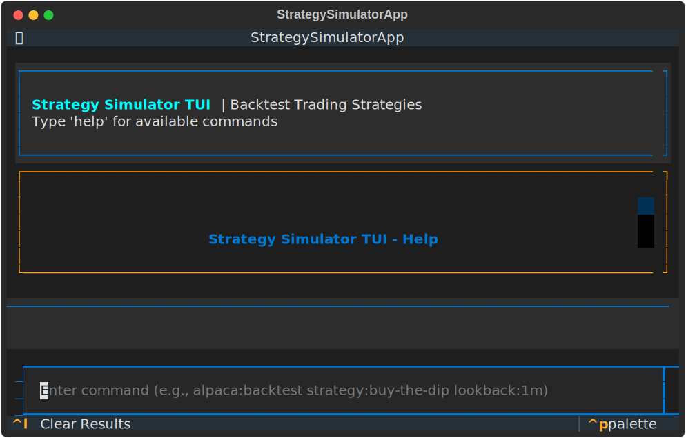
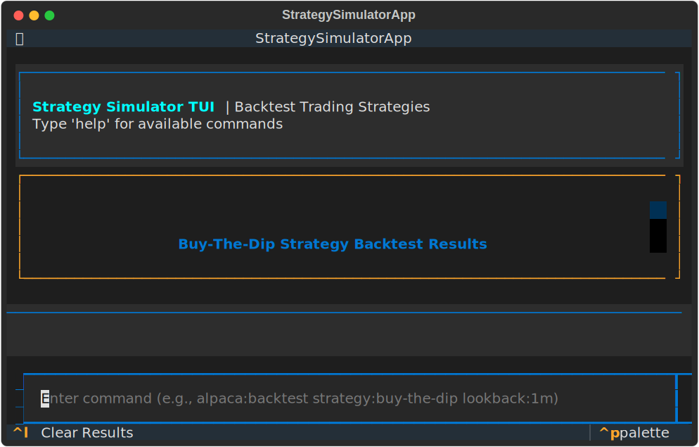
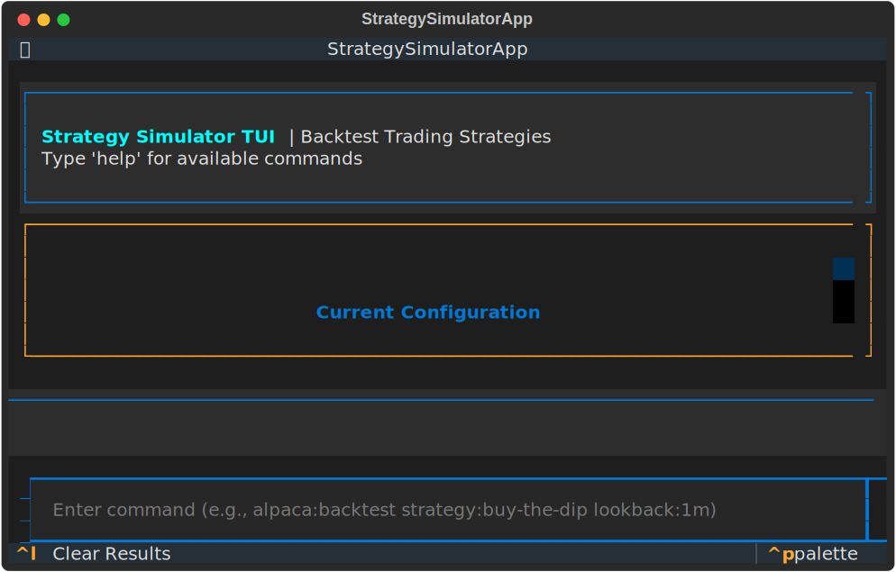

# Strategy Simulator TUI

A Terminal User Interface (TUI) for the Strategy Simulator, built with [Textual](https://textual.textualize.io/).

## Features

- **Interactive Terminal UI**: Beautiful, responsive terminal interface
- **Command-based Interface**: Quick backtesting with shortcut commands
- **Multiple Strategies**: Support for buy-the-dip and momentum strategies
- **Flexible Parameters**: Customize lookback periods, position sizing, and strategy parameters
- **Real-time Results**: View backtest results with performance metrics and trade history

## Installation

Install the required dependencies:

```bash
pip install -r requirements.txt
```

## Usage

### Starting the TUI

```bash
python3 strategy_tui.py
```

### Command Format

The TUI uses a command-based interface similar to trading terminals:

```
alpaca:backtest strategy:<strategy_name> lookback:<period> [options]
```

### Required Parameters

- `strategy:<name>` - Strategy to backtest
  - `buy-the-dip` - Buy on price dips with take-profit/stop-loss
  - `momentum` - Momentum-based trading strategy

- `lookback:<period>` - Historical period to backtest
  - `1m`, `2m`, `3m`, `6m`, `1y` (months or year)

### Optional Parameters

- `symbols:<TICKER1,TICKER2,...>` - Comma-separated tickers (default: Magnificent 7)
- `capital:<amount>` - Initial capital (default: 10000)
- `position:<pct>` - Position size percentage (default: 10)
- `dip:<pct>` - Dip threshold for buy-the-dip (default: 2.0)
- `hold:<days>` - Hold days (default: 1)
- `takeprofit:<pct>` - Take profit percentage (default: 1.0)
- `stoploss:<pct>` - Stop loss percentage (default: 0.5)
- `interval:<freq>` - Data frequency: 1d, 60m, 30m, 15m, 5m (default: 1d)

### Examples

**Basic buy-the-dip backtest (1 month):**
```
alpaca:backtest strategy:buy-the-dip lookback:1m
```

**Momentum strategy with custom symbols (3 months):**
```
alpaca:backtest strategy:momentum lookback:3m symbols:AAPL,TSLA,NVDA
```

**Buy-the-dip with custom parameters:**
```
alpaca:backtest strategy:buy-the-dip lookback:6m capital:50000 position:15 dip:3.0 takeprofit:2.0 stoploss:1.0
```

**Intraday backtest with 60-minute intervals:**
```
alpaca:backtest strategy:buy-the-dip lookback:1m interval:60m
```

### Other Commands

- `help` or `h` - Show help message
- `status` - Show current configuration
- `clear` or `cls` - Clear results
- `q`, `exit`, or `quit` - Exit application

### Keyboard Shortcuts

- `Ctrl+L` - Clear results
- `Ctrl+C` or `Q` - Quit application

## Output

The TUI displays:

1. **Configuration**: Strategy parameters and settings
2. **Performance Metrics**: 
   - Total Return & P&L
   - Annualized Return
   - Win Rate & Trade Statistics
   - Max Drawdown
   - Sharpe Ratio
3. **Recent Trades**: Last 10 trades with entry/exit details
4. **Summary**: Overall performance analysis

## Screenshots

### Welcome Screen


### Help Command


### Backtest Results


### Status Command


## Architecture

The TUI is built with:

- **Textual**: Modern Python TUI framework
- **Rich**: Terminal formatting and tables
- **Async/Await**: Non-blocking command processing

### File Structure

```
strategy-simulator/
├── strategy_tui.py          # Main entry point
├── tui/
│   ├── __init__.py
│   ├── app.py              # Textual app definition
│   └── command_processor.py # Command parsing and execution
├── screenshots/            # TUI screenshots
└── TUI_README.md          # This file
```

## Comparison with Streamlit UI

| Feature | Streamlit UI | TUI |
|---------|--------------|-----|
| Interface | Web-based GUI | Terminal-based |
| Speed | Slower (page loads) | Instant commands |
| Accessibility | Browser required | Terminal only |
| Visualization | Rich charts | Text-based tables |
| Use Case | Detailed analysis | Quick backtests |

## Development

The TUI replicates the core functionality of the Streamlit interface but optimized for command-line usage:

- Same backtesting engine (`utils/backtester_util.py`)
- Same strategies (buy-the-dip, momentum)
- Same data sources (yfinance)
- Same fee calculations (TAF, CAT)

## Future Enhancements

- [ ] Interactive charts in terminal
- [ ] Command history navigation (up/down arrows)
- [ ] Saved command presets
- [ ] Real-time paper trading mode
- [ ] Export results to CSV/JSON

## License

Same as the main Strategy Simulator project.
