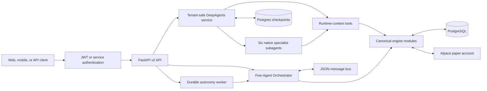
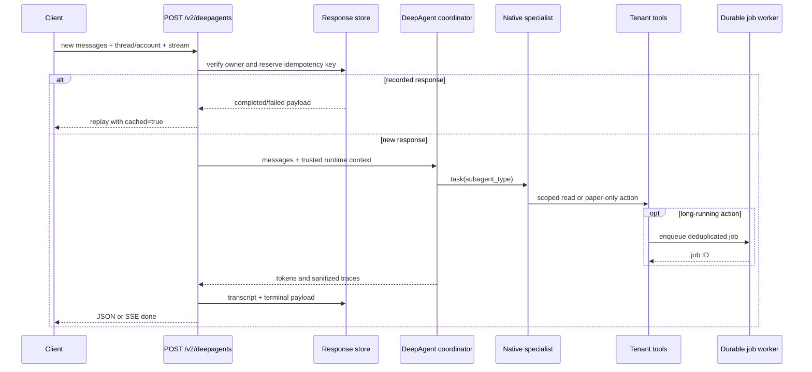
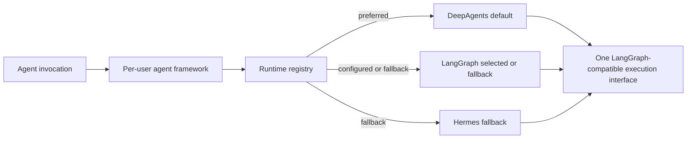
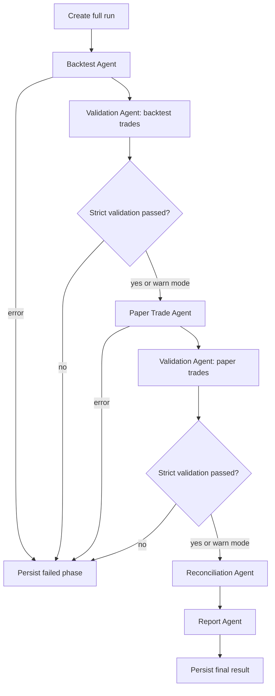
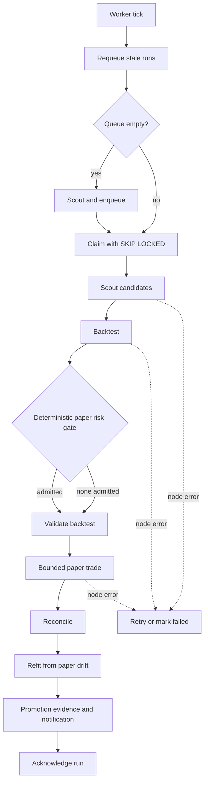

# Agent Architecture

This document describes the implemented AlpaTrade agent surface. The canonical
machine-readable catalog is `engine/agents/catalog.py` and is exposed by
`GET /v2/agents`. `api_app.py` owns the typed REST contract and
`engine/ai/deepagents.py` owns the shared API DeepAgents service. All trading
performed by agents is paper-only.

## Architecture at a Glance



## Public Agent Catalog

| Agent | Endpoint | Execution | Safety | Primary responsibility |
|---|---|---|---|---|
| DeepAgent Assistant | `POST /v2/deepagents` | JSON or SSE | paper-only | Canonical durable, idempotent, tenant-safe coordinator |
| DeepAgent JSON compatibility | `POST /v2/agents/chat/invoke` | synchronous | paper-only | Older single-message JSON contract over the shared service |
| DeepAgent SSE compatibility | `POST /v2/chat` | streaming | scoped | Older event shape; anonymous sessions are public-research-only |
| Premarket Agent | `POST /v2/agents/premarket/invoke` | synchronous | read-only | Movers, catalysts, rankings, and saved scans |
| Alpha Growth Agent | `POST /v2/agents/alpha-growth/invoke` | synchronous | read-only | Evidence-backed growth research |
| Alpha Value Agent | `POST /v2/agents/alpha-value/invoke` | synchronous | read-only | Valuation and margin-of-safety research |
| Alpha Comparison Agent | `POST /v2/agents/alpha-compare/invoke` | synchronous | read-only | Growth and value views over shared evidence |
| Backtest Agent | `POST /v2/backtest` | synchronous | read-only | Parameter sweeps and best-configuration selection |
| Validation Agent | `POST /v2/validate` | synchronous | read-only | Trade-price checks, anomalies, and corrections |
| Report Agent | `GET /v2/report` | synchronous | read-only | Run summaries, P&L, and strategy rankings |
| Daily Trading Advisor | `GET /v2/advisor/reports` | synchronous | read-only | Persisted, evidence-gated paper strategy and risk reviews |
| Paper Trade Agent | `POST /v2/paper` | asynchronous | paper-only | Durable background paper execution |
| Reconciliation Agent | `POST /v2/reconcile` | synchronous | paper-only | Database-versus-broker position checks |
| Five-Agent Orchestrator | `POST /v2/full` | synchronous | orchestration | End-to-end backtest-to-paper workflow |
| Autonomy Scout | `POST /v2/agents/autonomy-scout/invoke` | asynchronous | paper-only | Candidate scan and durable run enqueueing |

`/v2/deepagents` requires JWT authentication or a service key with `X-User-Id`.
Account-scoped operations resolve only that user's linked Alpaca paper account;
callers cannot select another user's thread or account. Anonymous `/v2/chat`
requests receive no portfolio or mutating tools.

## Canonical DeepAgent Flow

The canonical API treats each request's messages as append-only input. PostgreSQL
enforces a single running response per tenant/thread and a unique response per
final client message ID. The graph is cached by effective model provider/name;
tenant identity travels separately through `DeepAgentContext` and `ToolRuntime`.



The coordinator has only common fast reads (price, news, linked accounts,
account summary, positions, recent runs, and job status) plus DeepAgents'
`write_todos` and `task`. The only native subagents are:

| Subagent | Tool boundary |
|---|---|
| `market-research` | Public quotes, news, fundamentals, Alpha research, SEC, sectors, IPOs, funds, activists, press releases, SPACs, and prediction research |
| `portfolio-analyst` | Caller-owned account metadata, positions, runs, trades, reports, rankings, P&L, job status, and events |
| `strategy-lab` | Durable backtest queueing, owned-run validation, and strategy comparison |
| `paper-trader` | Caller-owned equity/index-option paper orders, paper sessions, reconciliation, cancellation, and monitoring |
| `orchestrator` | Durable full-cycle/autonomy queueing and phase inspection |
| `trading-advisor` | Read-only persisted daily evidence, recommendations, and report history |

DeepAgents' default general-purpose subagent is disabled. `ls`, `read_file`,
`write_file`, `edit_file`, `glob`, `grep`, and `execute` are excluded and rejected.
Tool arguments, results, credentials, and raw exceptions never appear in API traces.

The runtime registry still supports DeepAgents, LangGraph, Pydantic AI, and
Hermes for internal/legacy agents. `/v2/deepagents` is deliberately different:
it always builds with `create_deep_agent` and returns 503 if DeepAgents,
PostgreSQL checkpoints, or the configured model cannot be initialized. It never
silently falls back. Provider and model still come from the caller's settings.

### Are LangGraph and DeepAgents Both Used?

Yes, both are implemented, but only one configured runtime handles a given agent
invocation:

- **DeepAgents is the default.** `agui_app.primary_agent` and per-user chat agents
  are built through the runtime registry with `deepagents` preferred.
- **The canonical API is DeepAgents-only.** `engine.ai.deepagents.DeepAgentService`
  calls `create_deep_agent` directly and does not use the fallback registry.
- **LangGraph remains an active runtime and fallback.** A user can select it via
  `agent_framework`, and it is selected automatically when DeepAgents is not
  installed or available.
- **DeepAgents is LangGraph-compatible.** `DeepAgentsRuntime` extends the shared
  `LangGraphRuntime` adapter because DeepAgents compiles to a compatible graph.
  This is shared execution infrastructure, not two agents answering in parallel.
- **Autonomy reasoning uses the same registry.** Optional LLM annotations use the
  configured framework, while checkpointing, risk gates, sizing, execution, and
  promotion gates remain framework-neutral and deterministic.
- **The five specialist agents are ordinary Python classes.** Backtest,
  validation, paper trading, reconciliation, and reporting are coordinated by
  `Orchestrator`; they do not require either graph framework to execute.



## Five-Agent Orchestrator Flow

`agents/orchestrator.py` coordinates specialist classes and persists run state.
Validation can use `warn` mode or halt progression in `strict` mode.



Agents publish requests and updates through `engine/agents/message_bus.py`, backed
by `data/agent_messages/`. Coarse state is stored in `data/agent_state.json`;
run, trade, validation, and account data are stored in PostgreSQL with `user_id`
and `account_id` scope.

## Durable Autonomy Flow

The autonomy worker is separate from the synchronous orchestrator. It claims a
PostgreSQL queue row, heartbeats ownership, and checkpoints every node so stale
or interrupted runs can resume without repeating completed work.



The worker dispatches by job kind. DeepAgent backtest, paper, full-cycle, and daily-advisor jobs
share the queue with autonomy runs. The DeepAgent full-cycle checkpoints the
sequence Backtest → Validate → Paper → Validate → Reconcile → Report. A stale
paper-capable job is marked failed and is never automatically retried after an
uncertain worker failure; cancellation is tenant-scoped and signals active paper
sessions through their stop event.

The same worker is the sole owner of the daily-advisor scheduler. It reads the
actual Alpaca/NYSE calendar and enqueues one deduplicated tenant batch after the
session close plus 15 minutes, including holidays, early closes, and DST. Each
usable linked paper account gets a separate `advisor_reports` row; one
`advisor_deliveries` row consolidates those report IDs for the user's login email.
Email remains disabled until `ADVISOR_EMAIL_ENABLED=true`.

Advisor severity is deterministic: fewer than five closed paper trades is
`insufficient_data`; confirmed paper/backtest Sharpe drift, three losing
sessions, or 5% rolling drawdown is `review`; a 2% daily equity loss or existing
risk-limit breach is `urgent`; other losses remain `monitor`. DeepAgents only
ranks eligible server-generated next steps. Scheduled execution never queues those
tests, alters parameters, restarts a strategy, or places an order.

The hard safety boundary is `engine/autonomy/policy.py`: live candidates are
rejected, sizing is deterministic, and the autonomy package only wires the paper
trading phase. LLM reasoning may annotate scouting, selection, refit, and
promotion decisions, but it cannot override the deterministic risk or promotion
gates.

## Operational Entry Points

```bash
python agents/orchestrator.py --mode full
python agents/orchestrator.py --mode validate --run-id <uuid>
python -m engine.autonomy.worker
```

Inspect REST schemas at `/docs`, `/redoc`, or `/openapi.json`. Monitor durable
runs in the authenticated Agent Pipeline page and in the `autonomy_runs`,
`autonomy_run_steps`, `autonomy_events`, and `autonomy_promotions` tables.
DeepAgent API responses and sanitized traces live in `deepagent_responses`,
`deepagent_events`, and `deepagent_actions`; user-visible transcripts remain in
`chat_conversations` and `chat_messages`. LangGraph checkpoints use the official
PostgreSQL saver in the `alpatrade` search path with pickle fallback disabled.
Daily evidence and cross-surface advisory content live in `advisor_reports`; email
attempts and dedupe state live in `advisor_deliveries`.

Implementation references: [LangChain runtime context](https://docs.langchain.com/oss/python/langchain/runtime),
[DeepAgents 0.6.12 security model](https://pypi.org/project/deepagents/0.6.12/), and the
[official PostgreSQL checkpointer](https://github.com/langchain-ai/langgraph/blob/main/libs/checkpoint-postgres/README.md).
