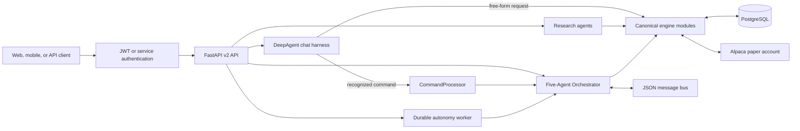
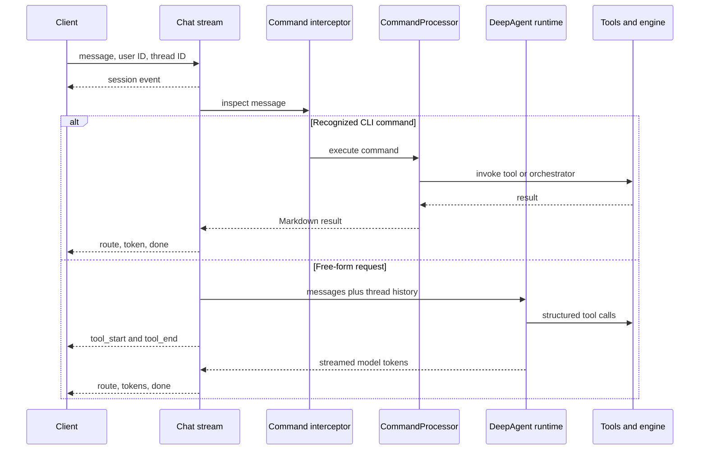
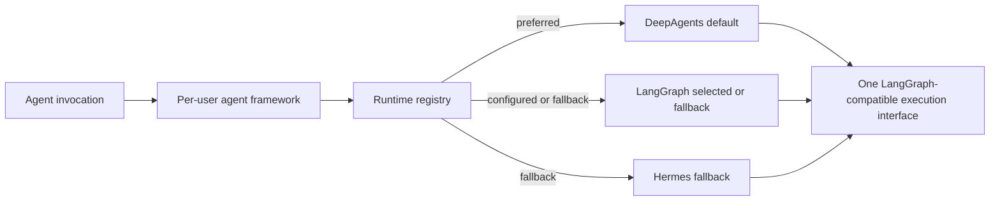
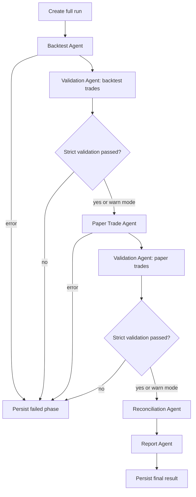
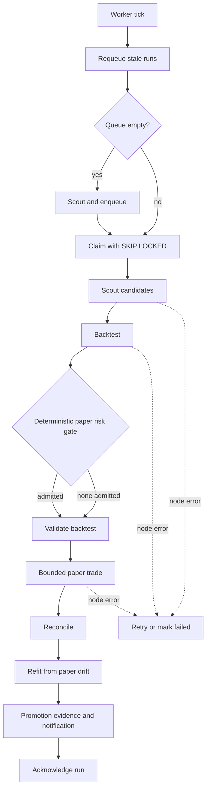

# Agent Architecture

This document describes the implemented AlpaTrade agent surface. The canonical
machine-readable catalog is `engine/agents/catalog.py` and is exposed by
`GET /v2/agents`. `api_app.py` owns the typed REST contract; `agui_app.py` owns
the shared conversational harness. All trading performed by agents is paper-only.

## Architecture at a Glance



## Public Agent Catalog

| Agent | Endpoint | Execution | Safety | Primary responsibility |
|---|---|---|---|---|
| DeepAgent Assistant | `POST /v2/agents/chat/invoke` | synchronous | paper-only | JSON chat response with route and tools used |
| DeepAgent Assistant SSE | `POST /v2/chat` | streaming | paper-only | Tokens, route events, tool events, and thread continuity |
| Premarket Agent | `POST /v2/agents/premarket/invoke` | synchronous | read-only | Movers, catalysts, rankings, and saved scans |
| Alpha Growth Agent | `POST /v2/agents/alpha-growth/invoke` | synchronous | read-only | Evidence-backed growth research |
| Alpha Value Agent | `POST /v2/agents/alpha-value/invoke` | synchronous | read-only | Valuation and margin-of-safety research |
| Alpha Comparison Agent | `POST /v2/agents/alpha-compare/invoke` | synchronous | read-only | Growth and value views over shared evidence |
| Backtest Agent | `POST /v2/backtest` | synchronous | read-only | Parameter sweeps and best-configuration selection |
| Validation Agent | `POST /v2/validate` | synchronous | read-only | Trade-price checks, anomalies, and corrections |
| Report Agent | `GET /v2/report` | synchronous | read-only | Run summaries, P&L, and strategy rankings |
| Paper Trade Agent | `POST /v2/paper` | asynchronous | paper-only | Durable background paper execution |
| Reconciliation Agent | `POST /v2/reconcile` | synchronous | paper-only | Database-versus-broker position checks |
| Five-Agent Orchestrator | `POST /v2/full` | synchronous | orchestration | End-to-end backtest-to-paper workflow |
| Autonomy Scout | `POST /v2/agents/autonomy-scout/invoke` | asynchronous | paper-only | Candidate scan and durable run enqueueing |

Except for the streaming `/v2/chat` interface, catalog operations require an
authenticated user. Account-scoped operations resolve that user's linked Alpaca
paper account; callers cannot select another user's account.

## Conversational Agent Flow

Web chat and both API chat forms reuse `engine/ai/chat_stream.py`. Per-user model
and framework settings are resolved by `agui_app.agent_for_user()`.



The runtime registry supports DeepAgents, LangGraph, Pydantic AI, and Hermes.
The default is DeepAgents; unavailable runtimes fall back in the order
DeepAgents → LangGraph → Hermes. Provider and model selection remain independent
of the agent framework.

### Are LangGraph and DeepAgents Both Used?

Yes, both are implemented, but only one configured runtime handles a given agent
invocation:

- **DeepAgents is the default.** `agui_app.primary_agent` and per-user chat agents
  are built through the runtime registry with `deepagents` preferred.
- **LangGraph remains an active runtime and fallback.** A user can select it via
  `agent_framework`, and it is selected automatically when DeepAgents is not
  installed or available.
- **DeepAgents is LangGraph-compatible.** `DeepAgentsRuntime` extends the shared
  `LangGraphRuntime` adapter because DeepAgents compiles to a compatible graph.
  This is shared execution infrastructure, not two agents answering in parallel.
- **Autonomy reasoning uses the same registry.** Optional LLM annotations use the
  configured framework, while checkpointing, risk gates, sizing, execution, and
  promotion gates remain framework-neutral and deterministic.
- **The five specialist agents are ordinary Python classes.** Backtest,
  validation, paper trading, reconciliation, and reporting are coordinated by
  `Orchestrator`; they do not require either graph framework to execute.



## Five-Agent Orchestrator Flow

`agents/orchestrator.py` coordinates specialist classes and persists run state.
Validation can use `warn` mode or halt progression in `strict` mode.



Agents publish requests and updates through `engine/agents/message_bus.py`, backed
by `data/agent_messages/`. Coarse state is stored in `data/agent_state.json`;
run, trade, validation, and account data are stored in PostgreSQL with `user_id`
and `account_id` scope.

## Durable Autonomy Flow

The autonomy worker is separate from the synchronous orchestrator. It claims a
PostgreSQL queue row, heartbeats ownership, and checkpoints every node so stale
or interrupted runs can resume without repeating completed work.



The hard safety boundary is `engine/autonomy/policy.py`: live candidates are
rejected, sizing is deterministic, and the autonomy package only wires the paper
trading phase. LLM reasoning may annotate scouting, selection, refit, and
promotion decisions, but it cannot override the deterministic risk or promotion
gates.

## Operational Entry Points

```bash
python agents/orchestrator.py --mode full
python agents/orchestrator.py --mode validate --run-id <uuid>
python -m engine.autonomy.worker
```

Inspect REST schemas at `/docs`, `/redoc`, or `/openapi.json`. Monitor durable
runs in the authenticated Agent Pipeline page and in the `autonomy_runs`,
`autonomy_run_steps`, `autonomy_events`, and `autonomy_promotions` tables.
