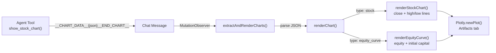

# AG-UI Chat Interface

AlpaTrade's AG-UI app is a 3-pane chat interface that bridges pydantic-ai agents to a FastHTML web UI via the [AG-UI protocol](https://docs.ag-ui.com). It supports CLI commands, AI-powered stock research, and real-time streaming with a thinking trace pane.

## Architecture

```
┌─────────────┐     ┌──────────────┐     ┌─────────────────┐
│  Browser     │◄───►│  FastHTML     │◄───►│  pydantic-ai    │
│  (HTMX +     │ WS  │  agui_app.py │     │  Agent (XAI     │
│   WebSocket) │     │  port 5003   │     │  Grok-3-mini)   │
└─────────────┘     └──────┬───────┘     └─────────────────┘
                           │
                    ┌──────┴───────┐
                    │ Command      │
                    │ Interceptor  │
                    └──────┬───────┘
                           │
              ┌────────────┼────────────┐
              │            │            │
        ┌─────┴────┐ ┌────┴─────┐ ┌───┴────────┐
        │ Command  │ │ Market   │ │ Alpaca API │
        │ Processor│ │ Research │ │ (paper)    │
        └──────────┘ └──────────┘ └────────────┘
```

### 3-Pane Layout

| Pane | Content |
|------|---------|
| **Left** (260px) | Auth forms / user info, navigation, quick reference, query status |
| **Center** (flex) | Chat messages + input form (WebSocket streaming) |
| **Right** (380px, toggled) | Thinking trace (tool calls, run events) + artifact canvas (Plotly charts) |

### Key Components

| File | Purpose |
|------|---------|
| `agui_app.py` | Main app — agent definition, tools, layout, auth routes, command interceptor |
| `utils/agui/__init__.py` | Package exports |
| `utils/agui/core.py` | `AGUISetup`, `AGUIThread`, `UI` — WebSocket routing, message handling, run execution |
| `utils/agui/patches.py` | Monkey-patches `__ft__()` onto AG-UI event types for FastHTML rendering |
| `utils/agui/styles.py` | Chat CSS with custom properties (light theme + dark mode via `prefers-color-scheme`) |

## How It Works

### Message Flow

1. User types in the chat textarea and presses Enter (or clicks Send)
2. The form submits via WebSocket (`ws_send=True` on the FastHTML form)
3. `AGUIThread._handle_message()` receives the text
4. **Command interceptor** checks if it's a CLI command (e.g. `news:TSLA`, `agent:backtest`, `trades`)
   - If yes: routes to `CommandProcessor`, returns markdown directly to chat
   - If no: creates an `RunAgentInput` and triggers the pydantic-ai agent
5. Agent streams events via `AGUIAdapter.run_stream()`:
   - `RunStartedEvent` → trace pane opens
   - `TextMessageStartEvent` → empty bubble appears in chat
   - `TextMessageChunkEvent` → delta text appended to bubble
   - `ToolCallStartEvent` / `ToolCallEndEvent` → tool indicators in chat + trace
   - `TextMessageEndEvent` → streaming cursor removed, markdown rendered
   - `RunFinishedEvent` → status cleared

### OOB Swaps

AG-UI events render as tuples of FastHTML elements, each targeting different DOM IDs via HTMX Out-of-Band swaps (`hx_swap_oob`):

- `#chat-messages` — chat bubble content (via `beforeend`)
- `#trace-content` — trace entries (via `beforeend`)
- `#chat-status` — run status indicator (via `innerHTML`)
- `#streaming-{id}` — cursor removal (via `outerHTML`)

This allows a single WebSocket event to update both the chat area and the trace pane simultaneously.

### Command Interceptor

The interceptor detects CLI commands before they reach the AI agent:

```python
# Commands that bypass AI and go to CommandProcessor
_CLI_BASES = {"news", "profile", "financials", "price", "movers", "analysts", "valuation", "chart", "equity"}
_CLI_EXACT = {"trades", "runs", "status", "help", "guide", "positions", "account"}
```

Pattern matching:
- `agent:*` and `alpaca:*` prefixes → CommandProcessor (streaming for long-running)
- `chart:TICKER` and `equity:RUN_ID` → direct tool call (bypass CommandProcessor)
- `positions` and `account` → direct Alpaca API call
- Exact matches (`trades`, `runs`, `help`, etc.) → CommandProcessor
- Base matches (`news:TSLA`, `price:AAPL`, etc.) → CommandProcessor
- Everything else → AI agent (XAI Grok-3-mini)

### Agent Tools

The pydantic-ai agent has these tools registered:

| Tool | Description |
|------|-------------|
| `get_stock_price(ticker)` | Current price, change, OHLCV via yfinance |
| `get_stock_news(ticker, limit)` | Headlines via `MarketResearch.news()` |
| `get_analyst_ratings(ticker)` | Ratings and price targets |
| `get_company_profile(ticker)` | Company info, sector, details |
| `get_financials(ticker, period)` | Revenue, earnings, margins |
| `get_market_movers(direction)` | Top gainers/losers |
| `get_valuation(tickers)` | P/E, P/B, EV/EBITDA comparison |
| `get_alpaca_positions()` | Open positions from Alpaca paper account |
| `get_alpaca_account()` | Account summary — portfolio value, cash, buying power |
| `show_recent_trades(limit)` | Trades from DB |
| `show_recent_runs(limit)` | Backtest/paper runs from DB |
| `show_stock_chart(ticker, period)` | Price chart via `__CHART_DATA__` marker → Plotly |
| `show_equity_curve(run_id)` | Equity curve from backtest trades → Plotly (supports prefix matching) |

### Chart Rendering

Charts use a marker-based protocol: tools return `__CHART_DATA__{json}__END_CHART__` which the frontend detects and renders with Plotly.js.



Chart data is extracted from raw text **before** markdown parsing to prevent `marked.parse()` from converting double underscores to `<strong>` tags.

Two chart types:
- **Stock chart** — close price (blue fill), high (green dotted), low (red dotted)
- **Equity curve** — equity line (blue fill) + initial capital dashed line (gray)

### Follow-up Suggestion Pills

After commands complete, contextual suggestion pills appear below the input. These include chart suggestions:

| Command | Suggestions |
|---------|------------|
| `agent:backtest` (with run_id) | validate, `equity:{id}`, report, top |
| `agent:validate` (with run_id) | `equity:{id}`, report, trades, top |
| `price:AAPL` | `chart:AAPL`, news, analysts, financials |
| `news:TSLA` | `chart:TSLA`, price, analysts, profile |
| `analysts:GOOGL` | `chart:GOOGL`, price, news, financials |

## Theming

Light-only theme. Two CSS layers:
- **Layout CSS** (`LAYOUT_CSS` in `agui_app.py`) — 3-pane grid, sidebar, trace entries, auth forms
- **Chat CSS** (`CHAT_UI_STYLES` in `utils/agui/styles.py`) — message bubbles, input form, streaming cursor

## Authentication

The AG-UI app has its own auth routes (separate from `web_app.py`):

| Route | Method | Purpose |
|-------|--------|---------|
| `/agui-auth/login-form` | GET | Login form fragment (HTMX) |
| `/agui-auth/register-form` | GET | Register form fragment (HTMX) |
| `/agui-auth/login` | POST | Authenticate → set session → reload |
| `/agui-auth/register` | POST | Create user → set session → reload |
| `/profile` | GET | User info + Alpaca key management |
| `/profile/keys` | POST | Encrypt and store Alpaca API keys |
| `/logout` | GET | Clear session, redirect to `/` |

Auth state flows into the command interceptor:
```python
user_id = session.get("user", {}).get("user_id")
cp = CommandProcessor(_app_state, user_id=user_id)
```

Unauthenticated users get 50 free queries per session.

## Running Locally

```bash
# Development with auto-reload
uv run uvicorn agui_app:app --host 0.0.0.0 --port 5003 --reload

# Or directly
uv run python agui_app.py
```

Required environment variables:
- `XAI_API_KEY` — for the AI agent (XAI Grok-3-mini)
- `DATABASE_URL` — for trades/runs queries
- `ENCRYPTION_KEY` — for decrypting per-user Alpaca keys
- `JWT_SECRET` — for session signing

Optional:
- `MASSIVE_API_KEY` — for movers command (Polygon.io)
- `EODHD_API_KEY` — for intraday price data

## Vendored AG-UI Library

The `utils/agui/` package is a vendored adaptation of [ft-agui](https://github.com/Novia-RDI-Seafaring/ft-ag-ui) by Christoffer Bjorkskog / Novia University (MIT license). Key adaptations:

- **3-pane layout** with togglable trace pane (original was single-pane)
- **Command interceptor** pattern for routing CLI commands
- **OOB tuple returns** from `__ft__()` patches for multi-target DOM updates
- **Markdown rendering** via marked.js with MutationObserver-based auto-render
- **Chart rendering** via Plotly.js with `__CHART_DATA__` marker detection
- **Streaming cursor** (blinking `|`) removed on `TextMessageEndEvent`

## Screenshots

### AI Chat with Trace Pane


### News Command


### Help Command

