# DeepAgent End-to-End Flow

This is the source-of-truth flow for the implemented AlpaTrade DeepAgent
integration in version 0.10.0. It covers the canonical API, compatibility chat
transports, specialist routing, tenant and action safety, durable jobs, and the
daily paper-trading advisor.

Two graphs have deliberately different jobs:

- The **interactive coordinator** answers authenticated chat/API requests,
  delegates to six specialists, and may call tenant-scoped tools.
- The **scheduled daily advisor** is read-only and stateless. It receives a
  deterministic evidence package and can only rank server-created candidate IDs.

The legacy five-agent `Orchestrator` and the autonomy worker are execution
services called below the DeepAgent tool layer. They are not additional native
DeepAgent subagents.

## Complete System Map

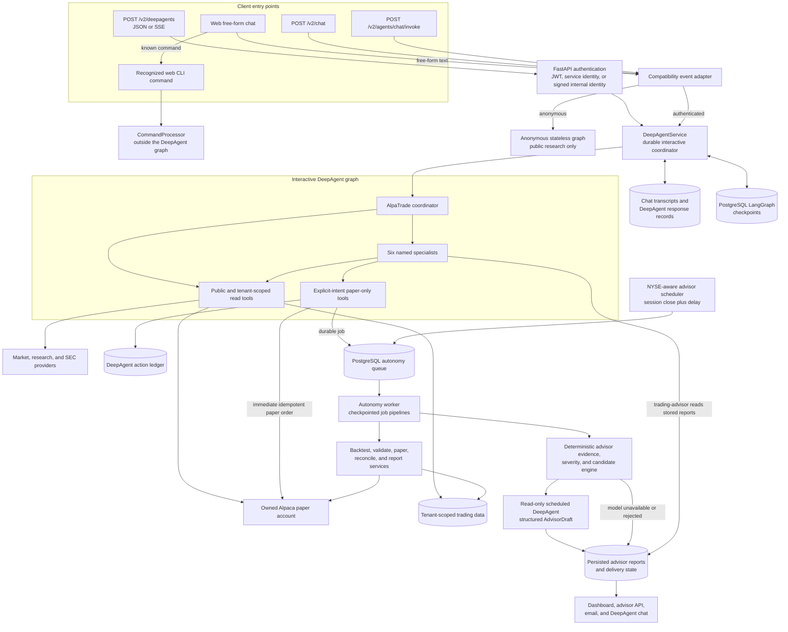

The canonical endpoint always builds with `create_deep_agent`. It does not switch
to LangGraph, Pydantic AI, or Hermes when DeepAgents is unavailable. The selected
model still comes from the caller's settings, and the graph cache is keyed by the
effective provider, actual model name, and public/authenticated mode.

## Entry and Authentication Routing

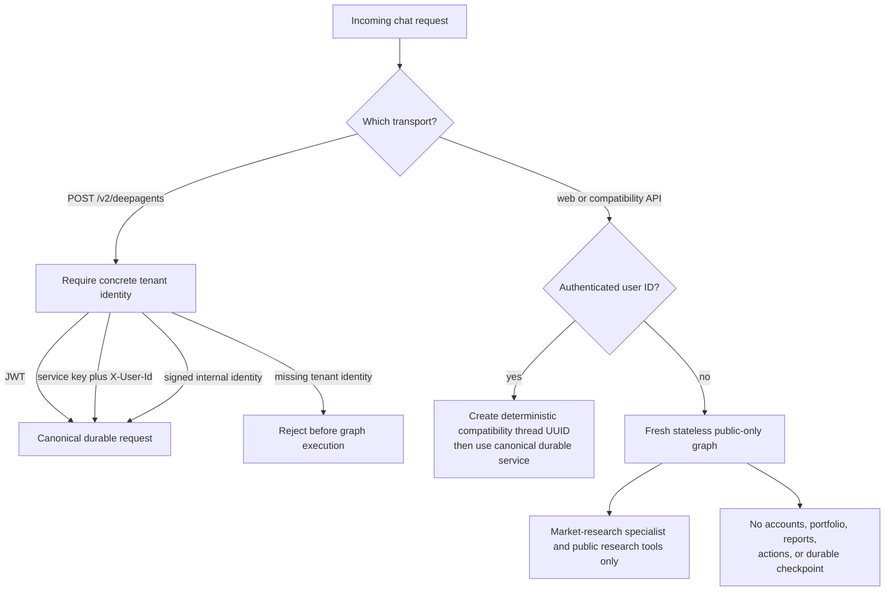

For web chat, known CLI commands are intercepted before this routing and sent to
`CommandProcessor`. Free-form text uses the compatibility adapter. The canonical
`POST /v2/deepagents` endpoint never passes through the command interceptor.

## Canonical Request Lifecycle

The final client message UUID is the response idempotency key. A request
fingerprint also covers the complete submitted message batch and selected
`account_id`.

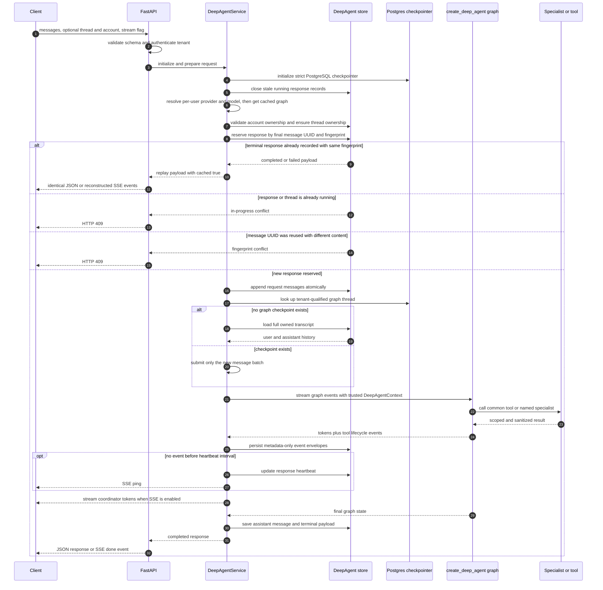

The checkpoint thread key is tenant-qualified as `user_id:thread_id`, while
application transcripts and response records retain explicit ownership columns.
Only coordinator output is emitted as the final answer; nested specialist model
tokens are not leaked directly into the client stream.

If execution fails, the service persists a terminal failed payload. Replaying the
same message returns that failure instead of rerunning tools. If an SSE client
disconnects before completion, the response is marked failed so a possibly
completed side effect is not silently repeated.

## Coordinator and Specialist Routing

The general-purpose DeepAgents subagent is disabled. The coordinator can use a
small set of fast reads directly or delegate through `task` to exactly these six
specialists.

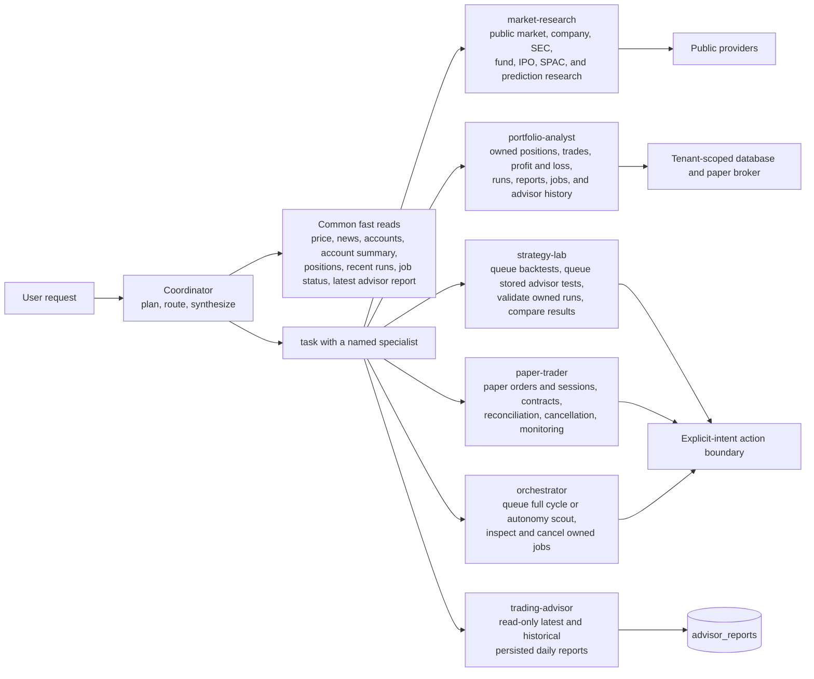

The `trading-advisor` specialist is intentionally read-only. Executing one of its
stored recommendations belongs to `strategy-lab` or `paper-trader` and requires a
later imperative user message.

## Tenant, Tool, and Action Safety

`DeepAgentContext` is constructed by the application and injected through
`ToolRuntime`; the model cannot choose its `user_id`, `account_id`, thread,
response, or request message. Middleware carries that trusted context into nested
specialist calls.

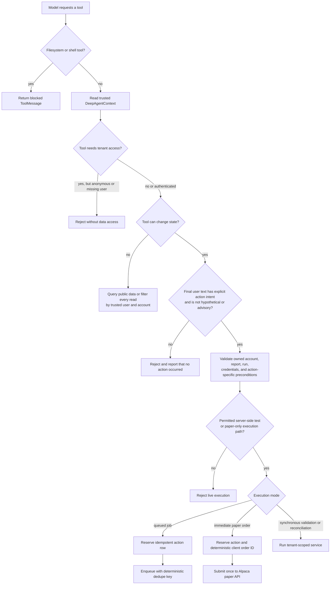

The host tools `ls`, `read_file`, `write_file`, `edit_file`, `glob`, `grep`, and
`execute` are excluded from the harness and rejected by middleware. API traces
store tool name, call ID, status, and timestamps only; arguments, results,
credentials, and raw exceptions are excluded.

## Durable Action Jobs

Long-running work is queued in PostgreSQL. A worker atomically claims the oldest
eligible row with `FOR UPDATE SKIP LOCKED`, heartbeats it, and checkpoints every
pipeline node. The dedicated advisor lane can claim daily reports while the
general lane is occupied by a long paper session.

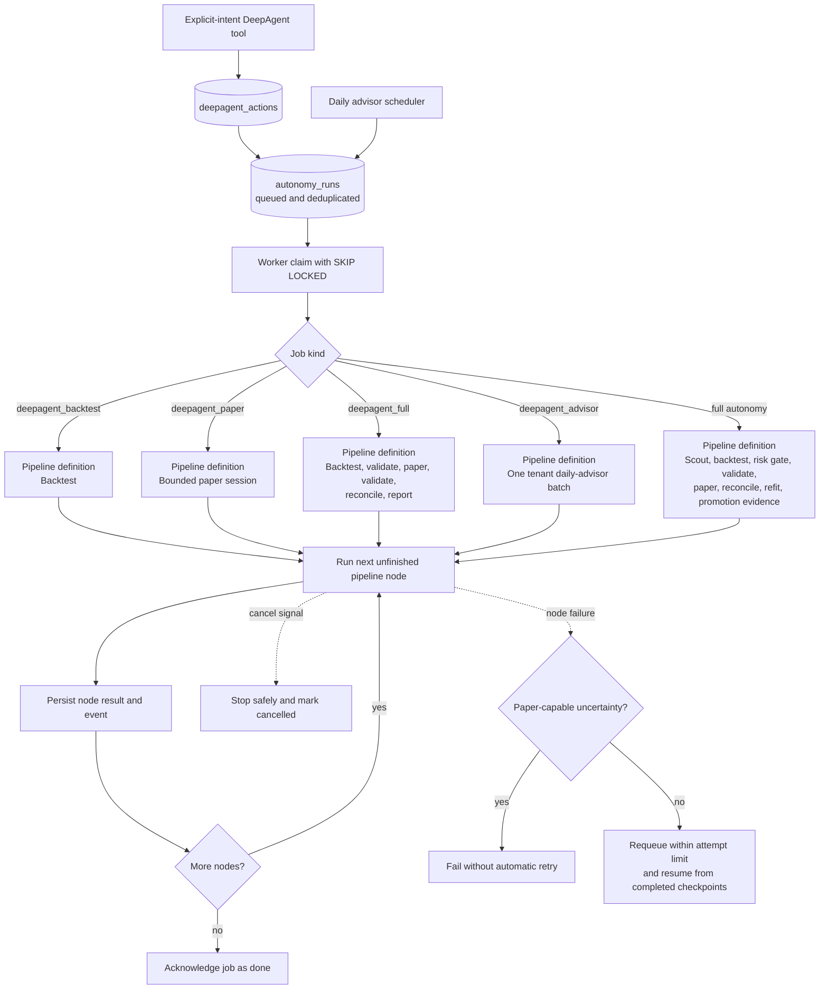

A resumed job skips each node already recorded as completed. `full`,
`deepagent_paper`, and `deepagent_full` fail closed after an uncertain worker
loss, because retrying could duplicate paper activity. Backtest and advisor jobs
may be retried and resume from their persisted step state.

## Daily Advisor Scheduling and Generation

The autonomy worker is the only scheduler owner. It asks Alpaca for the actual
NYSE session close, so weekends, holidays, early closes, and daylight-saving
changes do not rely on a fixed UTC time.

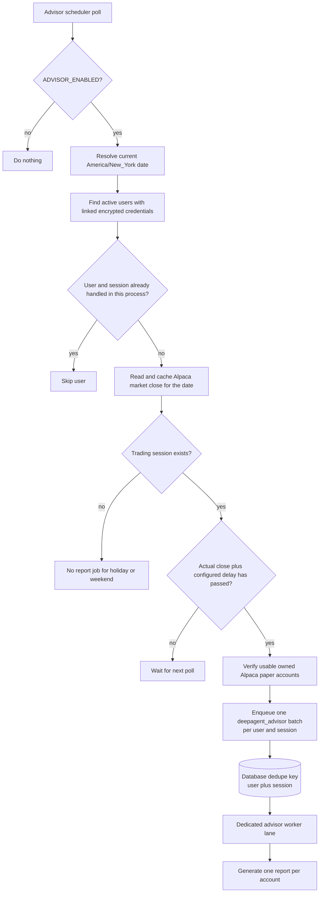

For every account in the batch, the report engine follows this flow:

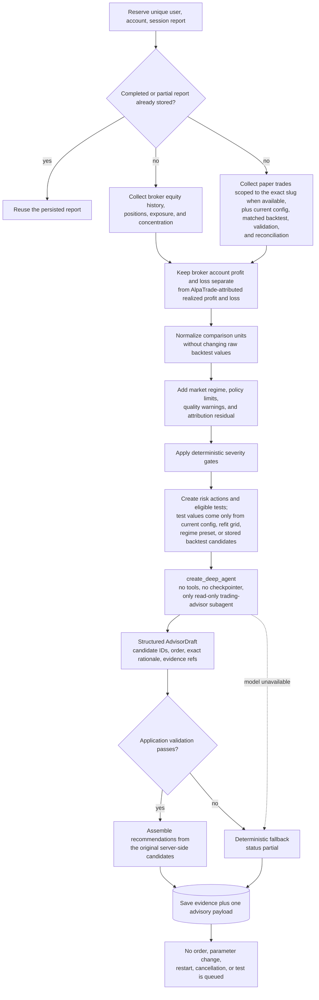

The scheduled graph uses `AdvisorDraft` as its structured response type. The
application rejects unknown or duplicated candidate IDs, missing or unsupported
evidence references, altered numbers, invented explanations, and omitted eligible
candidates on `review` or `urgent` reports. Parameter values are copied from the
server-side candidate after validation; they are never accepted from model text.

### Severity Decision Order

The implementation applies urgent risk gates first, so an urgent account cannot
be hidden by a small paper-trade sample.

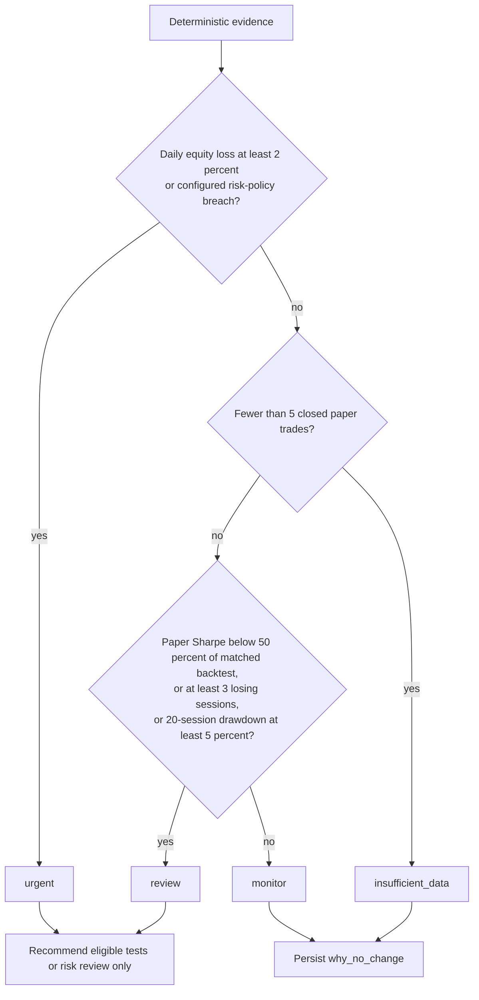

Thresholds are configurable through `ADVISOR_*` environment variables; the
diagram shows the shipped defaults. No-trade and profitable sessions still get a
report, with an explicit explanation when no change is justified.

## Consolidated Delivery and Shared Surfaces

The report is written once. Dashboard, API, email, and chat use the same stored
`evidence` and `advisory` payload instead of independently generating another
advisor report.

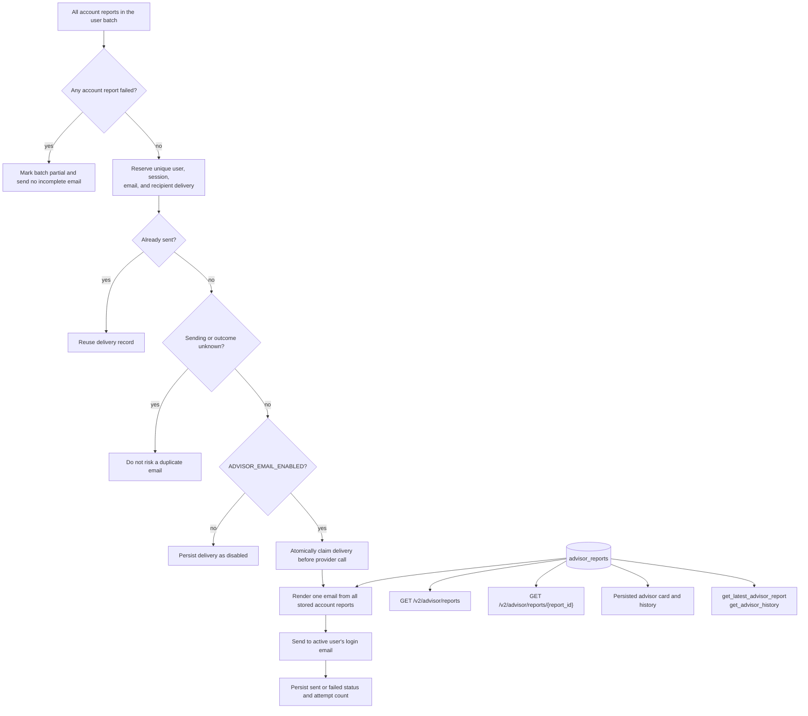

Email is disabled by default. A delivery left in `sending` after an uncertain
provider outcome is moved to `unknown` and is not automatically resent.

## Turning Advice Into a Paper Test

A report is never an instruction to execute. The user must issue separate,
explicit messages for each transition.

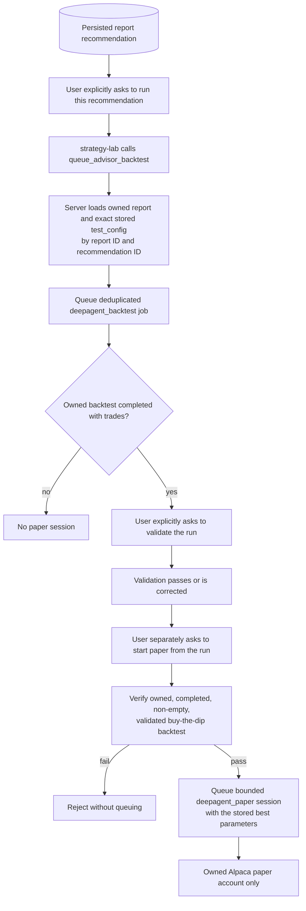

`queue_advisor_backtest` never accepts a replacement parameter grid from the
model. `queue_paper_from_backtest` currently supports `buy_the_dip` only and
requires an owned completed backtest, at least one trade, a stored best
configuration, and a passed or corrected backtest validation.

## Persistence Map

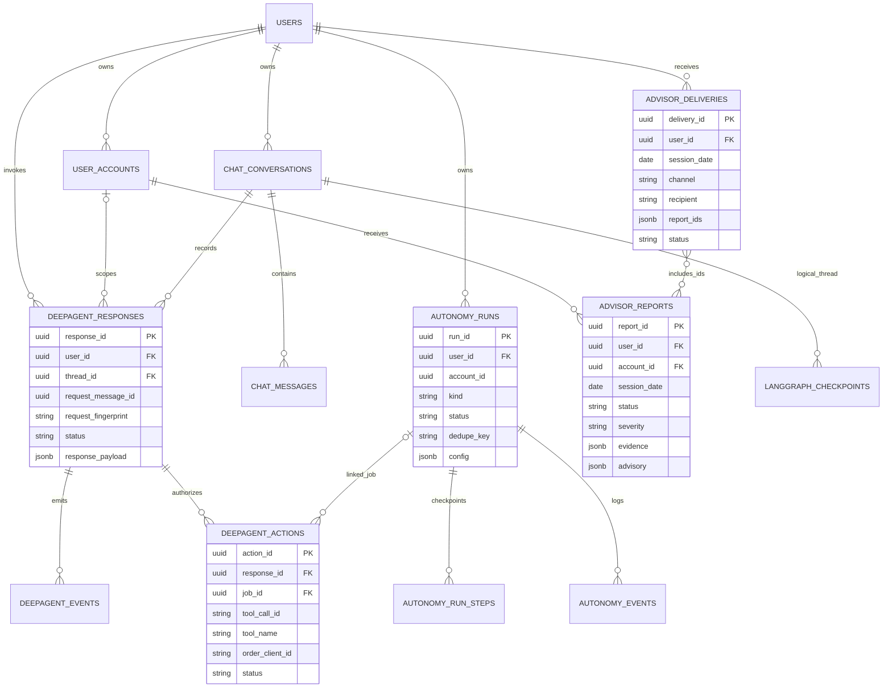

`LANGGRAPH_CHECKPOINTS` represents the official checkpointer tables as a logical
entity; they are created by `AsyncPostgresSaver` and use the tenant-qualified
thread key rather than an application foreign key. `advisor_deliveries.report_ids`
is a JSON list used to compose one user email, not a physical join table.

## Failure and Replay Behavior

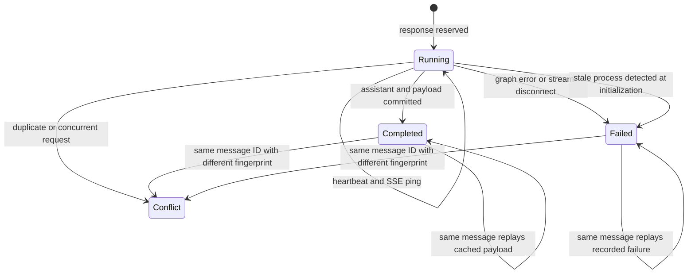

Operationally important fallbacks are:

- Canonical DeepAgent, model, or checkpointer unavailable: return HTTP 503.
- Blocked or unauthorized tool: return a tool error without exposing data.
- Scheduled advisor model unavailable or invalid: persist a deterministic
  `partial` report with metrics, severity, and a generation note.
- Broker evidence unavailable: persist quality warnings and keep broker results
  distinct from locally attributed strategy results.
- Paper-capable worker heartbeat lost: fail closed and do not automatically retry.
- Email outcome uncertain: record `unknown` and do not automatically resend.

## Implementation References

- Canonical service and event lifecycle: [`engine/ai/deepagents.py`](../engine/ai/deepagents.py)
- Trusted context, tools, and specialist definitions: [`engine/ai/deepagent_tools.py`](../engine/ai/deepagent_tools.py)
- Durable response and action store: [`engine/ai/deepagent_store.py`](../engine/ai/deepagent_store.py)
- API contracts and endpoints: [`api_app.py`](../api_app.py) and [`api_models.py`](../api_models.py)
- Compatibility chat adapter: [`engine/ai/chat_stream.py`](../engine/ai/chat_stream.py)
- Queue, worker, and checkpointed pipelines: [`engine/autonomy/queue.py`](../engine/autonomy/queue.py), [`engine/autonomy/worker.py`](../engine/autonomy/worker.py), and [`engine/autonomy/graph.py`](../engine/autonomy/graph.py)
- NYSE-aware scheduling: [`engine/autonomy/schedule.py`](../engine/autonomy/schedule.py)
- Advisor evidence and delivery engine: [`engine/reporting/advisor.py`](../engine/reporting/advisor.py)
- Database definitions: [`sql/22_deepagent_responses.sql`](../sql/22_deepagent_responses.sql) and [`sql/23_daily_advisor.sql`](../sql/23_daily_advisor.sql)
